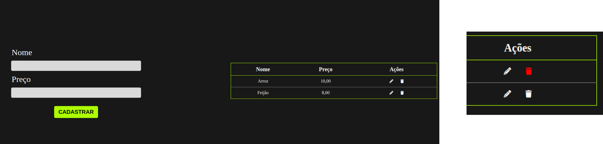

<h1 align="center">Crud</h1>

Sistema Crud (Create, Read, Update, Delete), desenvolvido por meio de estudos, utilizando HTML, CSS, JS e armazenando dados da tabela no LocalStorage do navegador. 
 

  <h2>🏠 Home </h2>
  

## 🚀 Tecnologias

Esse projeto foi desenvolvido com as seguintes tecnologias:

-  HTML
-  CSS
-  JavaScript
-  YouTube
-  Git e Github

## 🖱 Página publicada

-https://anacaasilva.github.io/Crud-Js/